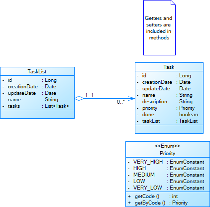

# TodoList API

## Сушности

UML-диаграмма классов сущностей показана ниже.

// XXX: у меня показалась :)

## Формат ошибок

В случае ошибки будет возвращен ответ:

    {
    	"httpCode": 404,
    	"message": "The task with id 3 is not found"
    }

где httpCode - копирует http-код, message - сообщение об ошибке.

## Общие ошибки

При нарушении синтаксиса запроса будет возвращен 400.

При соблюдении синтаксиса и нарушении ограничений на параметры запроса будет возвращен 400.

При ошибке сервера будет возвращен 500. 

## Формат данных

Для взаимодействия используется JSON.

	Content-Type: application/json
	Accept: application/json
	
Любые строки, которые могут быть отправлены клиентом в качестве параметра, имеют ограничение в длину 4096 символов.

Формат даты: ДД-ММ-ГГГГ

Все указанные далее параметры (в запросе или в теле запроса) обязательны, если не указано иное (например, значение по умолчанию).

## Сортировка

Для методов, у которых указана возможность сортировки результатов, используется параметр sort, который составляется следующим образом:

    X[:asc|desc[,Y[:asc|desc[,...]]]]
    
где X, Y - поля сортировки, asc - сортировка по возрастанию, desc - сортировка по убыванию, если не указывается, то сортируется по возрастанию.

## Фильтрация

Для методов, у которых указана возможность фильтрации, используется параметр filter, который должен содержат в себе выражение в префиксной форме,
с использованием: *=*(равно, при сравнении строк учитывается регистр), *>*(больше), 
*<*(меньше), *>=*(больше или равно), *<=*(меньше или равно), *&*(И), *|*(ИЛИ), *!*(НЕ), 
*like* (только для строк, ищет те строки, которые подходят под шаблон *%string%*, где *%* - любые символы или их отсутствие). Например:
    
    & > update_date 30-11-2020 like name 'Такой-то список дел'.
    
Для булевых значений используется значения *true*/*false* и используется только оператор *=*. Для строковых значений строки выносятся в одинарные кавычки.
Для экранирования одинарной кавычки используется *\'*
Пробелы между операторами и значениями обязательны. 
 
## Методы

### Получить списки

#### GET /lists

#### Параметры:

**limit** - лимит возвращаемых списков. Принимает значение от 1; при *limit*>100 принимает значение 10. Значение по умолчанию 10.

**sort** - сортировка списков. Поля сортировки: *creation_date*, *update_date*, *name*. Значение по умолчанию - сортировка по дате обновления по убыванию.

**filter** - фильтрация списков. Фильтрация происходит по полям *creation_date*, *update_date*, *name*. По умолчанию фильтрация не происходит.

**offset** - смещение. Принимает значения от 0. В ответе вернутся листы, которые идут начиная с номера *offset* включительно. По умолчанию 0.

#### Ответ:

Успешно: 200

    {
    	"openedListsCount": 2,
    	"closedListsCount": 3,
    	"totalListsCount": 6
    	"lists": [
    		{
    			"id": 1,
    			"name": "Мой хороший список",
    			"creationDate": "28-09-2020",
    			"updateDate": "29-09-2020"
    		},
    		...
    	]
    }

*openedListsCount*: количество списков, у которых есть незавершённые задачи.

*closedListsCount*: количество списков, у которых все задачи завершённые.

Если список пустой, то он не включается ни в *openedListsCount*, ни в *closedListsCount*.

*totalListsCount*: общее число списков в системе вообще.

### Добавить список

#### POST /list

#### Тело запроса:

    {
    	"name": "Мой хороший список"
    }

name должен быть непустой строкой (c учётом *trim*).

#### Ответ: 

Успешно: 201

    {
    	"id": 1,
    	"name": "Мой хороший список",
    	"creationDate": "28-09-2020",
    	"updateDate": "28-09-2020"
    }

### Изменить список 

#### PUT /list/*id*

#### Тело запроса:

    {
    	"name": "Мой плохой список"
    }

*name* должен быть непустой строкой (c учётом *trim*).

#### Ответ:

Успешно: 200

    {
    	"id": 1,
    	"name": "Мой плохой список",
    	"creationDate": "28-09-2020",
    	"updateDate": "29-09-2020"
    }

Списка *id* не существует: 404.

### Удалить список 

#### DELETE /list/*id*

#### Ответ:

Успешно: 204.

Списка *id* не существует: 404.

### Получить список

#### GET /list/*id*

#### Параметры

**limit** - лимит возвращаемых дел. Принимает значение от 1; при *limit*>100 принимает значение 10. Значение по умолчанию 10.

**sort** - сортировка дел. Поля сортировки: *creation_date*, *update_date*, *name*, *priority*, *done*.
Значение по умолчанию - сортировка по дате обновления по убыванию.

**filter** - фильтрация дел. Фильтрация происходит по полям: *creation_date*, *update_date*, *name*, *priority*, *done*. По умолчанию фильтрация не происходит.

**offset** - смещение. Принимает значения от 0. В ответе вернутся листы, которые идут начиная с номера *offset* включительно. По умолчанию 0.

#### Ответ:

Успешно: 200.

    {
    	"id": 1,
    	"name": "Мой хороший список",
    	"creationDate": "28-09-2020",
    	"updateDate": "29-09-2020",
    	"closedTasksCount": 1,
    	"openedTasksCount": 2,
    	"totalTasksCount": 5
    	"tasks": [
    		{
    			"id": 2,
    			"listId": 1,
    			"creationDate": "30-11-2020",
    			"updateDate": "01-12-2020",
    			"name": "Написать курсовую",
    			"description": "Необходимо написать курсовую",
    			"priority": 2,
    			"done": true
    		},
    		...
    	]
    }
    
*closedTasksCount*: количество сделанных задач.

*openedTasksCount*: количество несделанных задач.

*totalTasksCount*: общее количество задач в списке.

Списка *id* не существует: 404.

### Добавить дело

#### POST /task 

#### Тело запроса:

    {
    	"listId": 2,
    	"name": "Написать курсовую",
    	"description": "Эх бы вот написать курсовую",
    	"priority": 3
    }

*name* должен быть непустой строкой (c учётом *trim*). *priority* должен принимать значения от 1 до 5. *description" не обязательный параметр.

#### Ответ:

Успешно: 201.

    {
    	"id": 2,
    	"listId": 1,
    	"creationDate": "30-11-2020",
    	"updateDate": "30-11-2020",
    	"name": "Написать курсовую",
    	"description": "Необходимо написать курсовую",
    	"priority": 2,
    	"done": false
    }

Список *listId* не существует: 404.

### Изменить дело

#### PUT /task/*id*

#### Тело запроса:

    {
    	"listId": 2,
    	"name": "Написать курсовую",
    	"description": "Необходимо СРОЧНО написать курсовую",
    	"priority": 5,
    	"done": true
    }

*name* должен быть непустой строкой (c учётом *trim*). *priority* должен принимать значения от 1 до 5.  *description" не обязательный параметр.

#### Ответ:

Успешно: 200.

    {
    	"id": 2,
    	"listId": 2,
    	"creationDate": "30-11-2020",
    	"updateDate": "30-11-2020",
    	"name": "Написать курсовую",
    	"description": "Необходимо написать курсовую",
    	"priority": 2,
    	"done": false
    }

Дело *id* не существует: 404.

Список *listId* не существует: 404.

### Пометить дело как сделанное

#### POST /markDone/*id*

Если дело уже помечено как сделанное, это не будет считаться ошибкой.

#### Ответ:

Успешно: 204

Дело *id* не существует: 404.

### Удалить дело

#### DELETE /task/{id}

#### Ответ: 

Успешно: 204.

Дела *id* не существует: 404.
